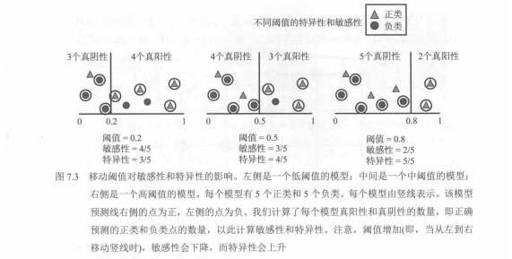
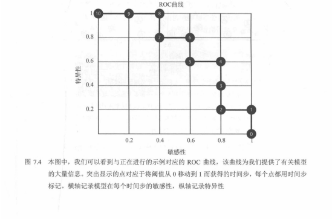
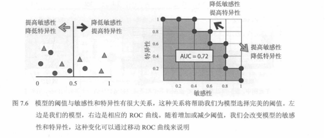
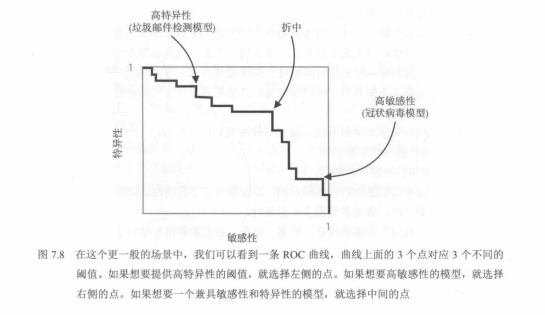
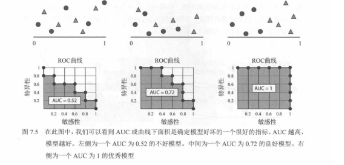
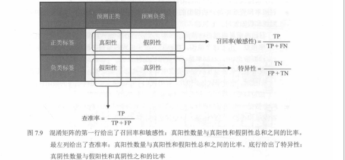

# 01.3 阈值、ROC 曲线与 AUC（7.3）

## 阈值与评分：从「概率」到「预测标签」

许多分类模型（如逻辑回归、神经网络、树模型）本质上给出的是**对每个样本属于正类的「打分」或「概率」**，例如：

- `p(x)` 表示模型对样本 `x` 属于正类的估计概率。

为了得到最终的「正 / 负」标签，需要选定一个**阈值（threshold）**：

- 若 `p(x) >= τ`，预测为正类；
- 若 `p(x) < τ`，预测为负类。

默认阈值常常取 0.5，但在**类不平衡**或**错报代价不同**的场景中，这个默认值往往并不合适。  
通过移动阈值 `τ`，我们可以在「TPR vs FPR」之间得到不同的组合，这正是 **ROC 曲线** 要表达的内容。

---

## ROC 曲线与 AUC

**ROC（receiver operating characteristic）曲线**最初用于雷达信号处理，后来广泛用于机器学习中的分类评估。  
核心思想：**随着决策阈值从「非常严格」到「非常宽松」连续改变，观察 TPR 与 FPR 如何变化。**

- 横轴：**FPR（假正率）**
- 纵轴：**TPR（召回率）**
- 每一个不同的阈值对应 ROC 图上的一个点；把所有点连起来就得到 ROC 曲线。



### 你真正要掌握的三件事（新人版）

1. **敏感性（Sensitivity）= 召回率（Recall）= TPR**  
   `TPR = TP / (TP + FN)`（更关心“别漏掉”）
2. **特异性（Specificity）= TNR**  
   `TNR = TN / (TN + FP)`（更关心“别误报”）  
   同时：`FPR = FP / (TN + FP) = 1 - TNR`
3. **ROC 的坐标轴一定要记对**：  
   - 横轴是 `FPR = 1 - Specificity`  
   - 纵轴是 `TPR = Sensitivity`

### 白话钉死四个量（和 ROC 的关系）

下面用**医疗筛查**做直觉（正类 = 「有病」，负类 = 「没病」）；换成别的任务，只是把「病」换成你的正类定义即可。

- **TPR（真正例率）= 敏感性（Sensitivity）= 召回率（Recall）**  
  含义：真实为正的样本里，有多大比例被判成阳性。直觉：**有病的人里抓出来多少**。  
  `TPR = TP / (TP + FN)`。**越高越好**（少漏检）。

- **FPR（假正例率）**  
  含义：真实为负的样本里，有多大比例被错判成正类。直觉：**没病的人里误判成有病多少**。  
  `FPR = FP / (TN + FP)`。**越低越好**（少误报）。

- **TNR（真负例率）= 特异性（Specificity）**  
  含义：真实为负的样本里，判成负类的比例。直觉：**没病的人里正确判成没病多少**。  
  `TNR = TN / (TN + FP)`。**越高越好**。

务必会换算：

`FPR = 1 − TNR = 1 − 特异性`

### ROC 在画什么？为什么理想点在左上角？

- 横轴：**FPR**（误报率，想靠近 0）  
- 纵轴：**TPR**（在真实正类里抓对的比例，想靠近 1）

**理想单点**是 **(0, 1)**：不误报、不漏检——在图上是**左上角**。

### 为什么好曲线要「往左上角凸」？

一句话：**在 FPR 还很小时，TPR 已经能抬得很高**，也就是**用很少的误报，换来很高的检出率**。

阈值从「严」到「松」扫过整条曲线时，可以对照三种情况：

1. **贴近对角线（约 45°，AUC≈0.5）**  
   TPR 涨多少，FPR 往往也跟着涨多少——**多抓一个真阳性，差不多就多冤枉一个阴性**，和随机猜差不多。

2. **一般模型**  
   曲线会**先陡后平**：开头 TPR 升得快、FPR 升得慢；后面想再抬 TPR，FPR 会明显变大。

3. **很强的模型**  
   曲线**明显向左上角拱**：**FPR 还很低时，TPR 已经很高**——接近「敏感性高、特异性也高」。

### 用敏感性、特异性再读一遍图

- **敏感性高** → TPR 高 → 曲线整体**靠上**。  
- **特异性高** → TNR 高 → FPR 低 → 曲线整体**靠左**。

所以 **高敏感性 + 高特异性** 就是同时往上、往左凑，也就是**左上角**。ROC 越往左上角凸，越说明：在**控制误报（高特异性 / 低 FPR）**的同时，**检出能力（高敏感性 / 高 TPR）**仍然很强。

### 极简手绘示意（文字版）

```
     TPR
      ^
 1.0  |  **** 强模型：先往上冲，再往右摊
      | *
      |*
 0.5  |       /  随机：≈ 对角线（抓一点就误报一点）
      |     /
 0.0  +-----------------> FPR
      0                 1
```

### 一句话收束

- **左上角**：少冤枉负类、多抓对正类。  
- **向左上凸**：性价比高——少一点误报，就能换来大量正确检出。  
- **贴对角线**：跟瞎猜差不多，多检出往往伴随同比的误报。

---

理想情况：

- 一个随机瞎猜的分类器，其 ROC 曲线大致在对角线附近（TPR ≈ FPR，没什么区分能力）。
- 一个好的分类器，曲线会尽量**向左上角凸起**：在保持较低 FPR 的同时获得较高 TPR。





**AUC（area under the curve）** = **ROC 曲线下方的面积**：在标准 ROC 图里（横轴 FPR、纵轴 TPR，都在 **0～1**），就是整条 ROC 曲线与 **横轴（TPR = 0）** 之间那一块；也常说成曲线与 **FPR = 0、TPR = 0、FPR = 1** 围成的区域（同一块面积的不同说法）。

范围：**0 ≤ AUC ≤ 1**。

- **曲线贴着对角线（瞎猜）** → AUC ≈ **0.5**
- **曲线越往左上角鼓** → 面积越大 → **AUC 越大**
- **几乎完美分类** → AUC 接近 **1**

### AUC 实际有什么用？（人话）

ROC 是一条弯线，**并排比较难**；AUC 把它压成**一个数**，方便在同一验证集上直接比模型（例如 A 的 AUC = 0.75、B 的 AUC = 0.88 → 通常可以说 **B 的整体区分/排序能力更强**）。注意：这是「扫过所有阈值」的综合分，**不等于**你选定业务阈值后的 Precision/Recall 一定更好，上线仍要看具体工作点与代价。

**（1）一句话、一个分，方便比模型**  
把复杂曲线收成标量，迭代选模时最常用的「排队指标」之一。

**（2）不依赖你最后选哪个阈值**  
准确率、精确率、召回率、F1 往往都要先固定阈值（如 `p ≥ 0.5` 算正）。风控、医疗、推荐等场景**阈值各不相同**；AUC 看的是**阈值从严到松扫一遍**的综合表现，衡量的是**打分/排序本身靠不靠谱**，而不是某个默认阈值下的单次截图。

**（3）类别很不平衡时，比「只看准确率」稳得多**  
例如 10000 个样本里 9900 个负类、100 个正类：全员判负准确率仍可达 99%，但毫无检出能力；这类情况 **AUC 往往接近 0.5**，不容易被多数类把准确率刷高骗过去。**补充**：正类**极端稀少**时，除 ROC-AUC 外也建议看 **PR 曲线**（见 `01.4 PR 曲线与补充指标.md`），避免只看 ROC 就下结论。

与单一阈值下的准确率不同，**AUC 相当于对所有可能阈值综合评估模型的排序能力**；在还不确定最终阈值、或更关心「谁该排在前面」时，AUC 是非常常用的指标。

**一句话**：AUC 可以理解为模型**区分正负样本能力**的「总分」，越高通常越强（在 ROC 这套定义下）。



### 图 7.9 速记：把所有“率”对回混淆矩阵

你可以用三句话把最常用的三个指标彻底分开：

- **“顶行看召回/敏感性（TPR）”**：`TPR = TP / (TP + FN)`
- **“左列看查准（Precision）”**：`Precision = TP / (TP + FP)`
- **“底行看特异（TNR）”**：`TNR = TN / (TN + FP)`（所以 `FPR = 1 - TNR`）



