# 02. 决策树模型（9.2）新人版总结 + 对应书本图号

这是《机器学习图解》第 9 章 **9.2 用例：决策树模型** 的内容整理。核心是：用决策树做 App 下载分类预测，通过一层层“是/否”提问划分数据，走一遍决策树的构建流程、特征选择、纯度指标与最终预测逻辑。

---

## 一、核心任务与案例背景

### 1) 任务目标

根据用户的两个特征：

- **平台**（苹果手机 / Android 手机）
- **年龄**（年轻人 / 成年人；20 岁以下为年轻人，20 岁及以上为成年人）

预测用户会下载 3 款应用中的哪一个：

- **Atom Count（原子计数）**
- **Beehive Finder（蜂箱查找）**
- **Check Mate Mate（寻找棋手）**

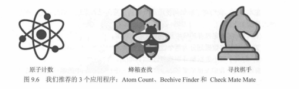

本质是一个**多分类**任务：用决策树的“提问—分流—到叶子出结论”实现自动推荐。

### 2) 数据集（表 9.2）

共 6 个用户样本（简化后如下）：

| 平台 | 年龄 | 应用 |
|---|---|---|
| 苹果手机 | 年轻人 | 原子计数 |
| 苹果手机 | 成年人 | 寻找棋手 |
| Android 手机 | 成年人 | 蜂箱查找 |
| 苹果手机 | 成年人 | 寻找棋手 |
| Android 手机 | 年轻人 | 原子计数 |
| Android 手机 | 年轻人 | 原子计数 |

---

## 二、第一步：两种特征划分方案对比（图 9.7、图 9.8）

决策树的核心是：**选最优特征作为根节点**。本节对比两种划分方式。

### 1) 方案 1：按「平台」划分（图 9.7）

- 根节点提问：**平台 = 苹果手机？**
- 分组结果：
  - 苹果手机组：{原子计数, 寻找棋手, 寻找棋手}
  - Android 组：{原子计数, 蜂箱查找, 原子计数}
- 直观问题：两组都有多个类别，数据不够“纯”

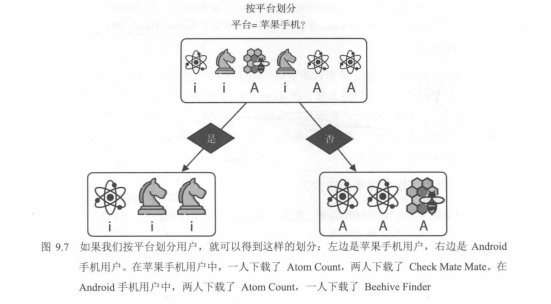

### 2) 方案 2：按「年龄」划分（图 9.8）

- 根节点提问：**年龄 = 年轻人？**
- 分组结果：
  - 年轻人组：{原子计数, 原子计数, 原子计数}（纯数据集）
  - 成年人组：{寻找棋手, 蜂箱查找, 寻找棋手}
- 直观优势：年轻人组完全纯净，划分效果更好

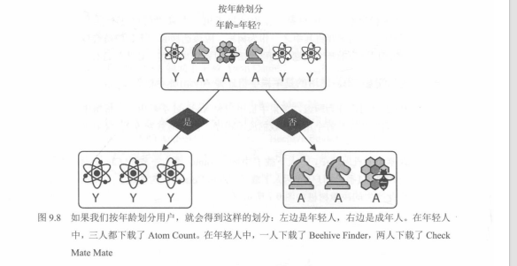

---

## 三、划分效果的 3 种量化评估方法

### 1) 准确率（图 9.9）

准确率定义：

`accuracy = 正确分类的样本数 / 总样本数`

- 分类器 1（按平台）：正确 4 次 → `accuracy = 4/6 ≈ 66.67%`
- 分类器 2（按年龄）：正确 5 次 → `accuracy = 5/6 ≈ 83.33%`

结论：按年龄划分准确率更高。

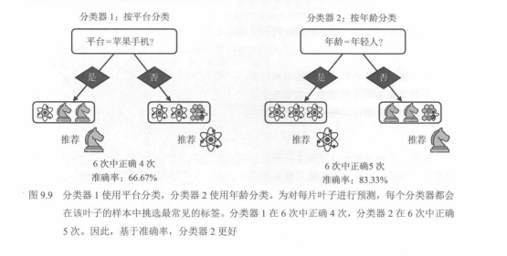

### 2) 基尼杂质（图 9.10～图 9.12）

基尼杂质的定义（越小越纯）：

`Gini = 1 - Σ p_i^2`

其中 `p_i` 是第 `i` 类样本占比。

对本例：

- 分类器 1（按平台）：两边都是 2:1 的分布  
  `Gini = 1 - (2/3)^2 - (1/3)^2 ≈ 0.444`  
  平均基尼：`0.444`
- 分类器 2（按年龄）：一边纯（3:0），另一边 2:1  
  平均基尼：`(0 + 0.444) / 2 = 0.222`

结论：按年龄划分的平均基尼更低，更优。

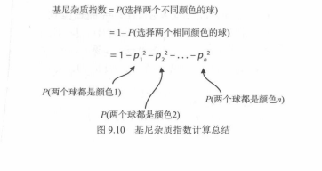
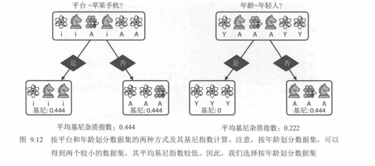

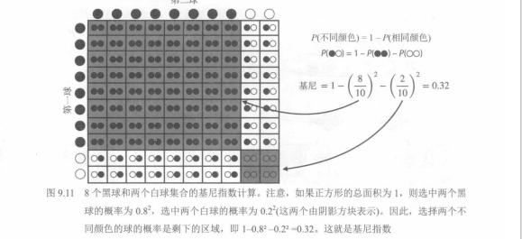

### 3) 熵（图 9.13）

熵的定义（越小越纯）：

`Entropy = - Σ p_i * log2(p_i)`

对本例：

- 分类器 1（按平台）：两边都是 2:1  
  `Entropy ≈ 0.918`  
  平均熵：`0.918`
- 分类器 2（按年龄）：一边纯（熵 = 0），另一边 2:1  
  平均熵：`(0 + 0.918) / 2 = 0.459`

结论：按年龄划分的平均熵更低，更优。

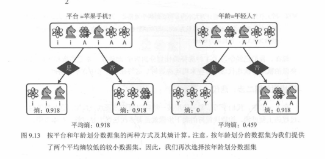

---

## 四、加权平均：处理样本量不均的情况（图 9.14）

当划分后两组样本量不同，纯度指标要用样本占比做权重（加权平均）。  
例如把 8 个样本分成 6 和 2 两组：

- 加权平均基尼：`0.444 * (6/8) + 0 * (2/8) = 0.333`
- 加权平均熵：`0.918 * (6/8) + 0 * (2/8) = 0.689`

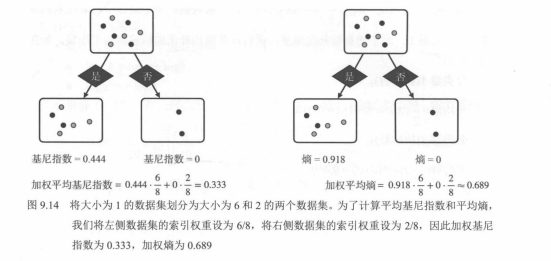

---

## 五、第二步：迭代划分，构建完整决策树（图 9.15～图 9.17）

### 1) 第一次划分：按年龄（图 9.15）

- 根节点：**年龄 = 年轻人？**
  - 是：直接推荐 **Atom Count**（纯数据集，成为叶节点）
  - 否：成年人组仍有两类，需要继续划分

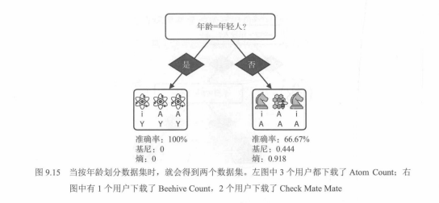

### 2) 第二次划分：按平台（图 9.16）

对成年人组继续问：**平台 = 苹果手机？**

- 是：全为「寻找棋手」→ 叶节点
- 否：全为「蜂箱查找」→ 叶节点

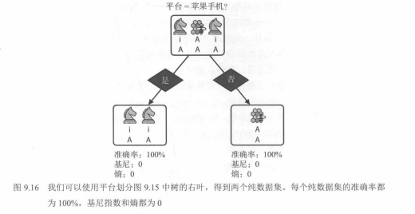

### 3) 最终完整决策树（图 9.17）

最终得到包含 2 个决策节点、3 个叶节点的树，可 100% 正确分类训练集样本。

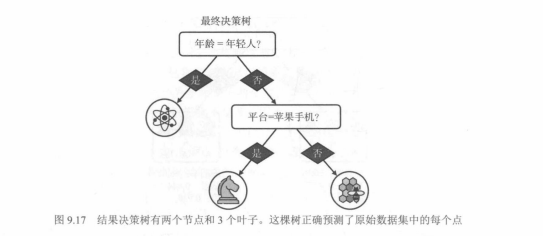

---

## 六、第三步：停止条件与超参数（防过拟合）

常见停止条件/超参数：

1. 纯度提升（准确率/基尼/熵）小于阈值
2. 节点样本数小于指定数量
3. 叶节点最小样本数限制
4. 树的最大深度限制

---

## 七、决策树算法伪代码与预测流程（对应图 9.17）

### 1) 伪代码（结构版）

- 输入：训练数据、划分指标（准确率/基尼/熵）、停止条件
- 输出：训练好的决策树
- 过程：
  1. 添加根节点，关联整个数据集
  2. 递归迭代：对每个叶节点，选最优特征划分数据集，生成新节点
  3. 满足停止条件时，标记为叶节点，输出该组最常见标签
  4. 重复直到所有节点都停止

### 2) 最终预测规则（本例可直接背）

- 若为**年轻人**：推荐 **Atom Count**
- 若为**成年人**：
  - Android：推荐 **Beehive Finder**
  - 苹果：推荐 **Check Mate Mate**

---

## 八、本节核心知识点总结（新人必背）

- 决策树核心：通过“是/否提问”递归划分数据，目标是让子集越来越纯
- 3 种划分指标：准确率（越高越好）、基尼（越低越好）、熵（越低越好）
- 特征选择原则：选划分后纯度提升最大的特征做根节点
- 纯数据集：全为同一类 → 基尼与熵都为 0 → 无需再划分
- 优点：可解释性强、通常不需要标准化、训练速度快
- 缺点：易过拟合，需要停止条件/剪枝；也因此常用集成（随机森林、XGBoost）

---

## 九、你需要截屏的书本图号（按顺序）

1. 图 9.7：按平台划分的决策树桩
2. 图 9.8：按年龄划分的决策树桩
3. 图 9.9：两种分类器的准确率对比
4. 图 9.10：基尼指数计算逻辑总结
5. 图 9.11：彩球示例的基尼指数计算
6. 图 9.12：两种划分的基尼指数对比
7. 图 9.13：两种划分的熵计算对比
8. 图 9.14：加权平均纯度计算示例
9. 图 9.15：按年龄第一次划分的决策树
10. 图 9.16：按平台二次划分的决策树
11. 图 9.17：最终完整决策树结构

---

## 十、补充：与前后章节关联

- 第 8 章：朴素贝叶斯（概率分类模型）
- 第 9 章：决策树（规则分类模型，是随机森林、XGBoost 的基础）
- 后续章节：剪枝、集成学习（随机森林、梯度提升树）

