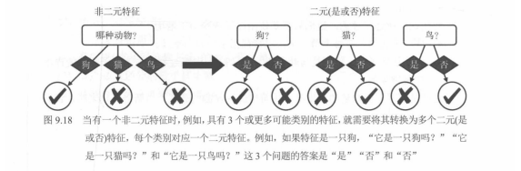
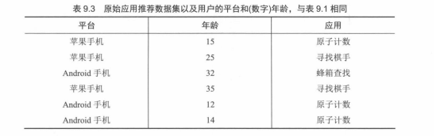
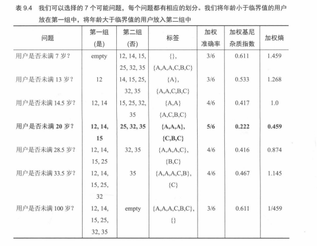
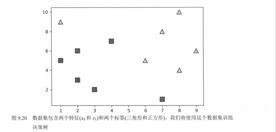
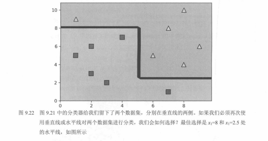
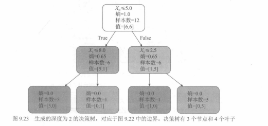

# 03. 决策树进阶：非二元特征、连续特征与边界（9.3～9.4）

本节对应教材第 9 章后半：**超出「是/否」二元特征**、**连续数值如何切阈值**、**二维空间里的分段边界**，以及用 **Scikit-Learn** 落地训练。可与 `02.决策树模型（9.2）新人版总结.md` 对照阅读。

---

## 一、9.3 超出「是」或「否」：非二元与连续特征

### 1. 非二元分类特征（如狗 / 猫 / 鸟）

**核心问题**：二元特征（如「是否苹果用户」）只要一个问题；多分类特征（动物有 3 类）不能在一个节点上直接分出 3 条「互斥答案」而不改表示方式。

**常用做法：独热编码（one-hot encoding）**

把 1 个多分类特征拆成多个二元特征，每个类别对应一个是/否问题：

- 原特征：「哪种动物？」（狗 / 猫 / 鸟）
- 拆成：「是狗吗？」「是猫吗？」「是鸟吗？」
- 若样本是「狗」，三个答案为：**是 / 否 / 否**

直觉：**把多分类拆成多个二分类子问题**，决策树仍按「是/否」一路划分。

**图 9.18：非二元特征 → 多个二元（是/否）特征**

教材用一张对照图说明：左侧是**一个**多分支问题「哪种动物？」（狗 / 猫 / 鸟 三条出路）；右侧等价地变成**三个**小决策——「狗？」「猫？」「鸟？」各自只分 **是 / 否**。若真实类别是「狗」，则三题答案依次为 **是、否、否**。这与数据预处理里的 **独热编码** 一致：原表 1 列类别，可展开为 3 列 0/1（实现上常用 `pandas.get_dummies` 或 `sklearn.preprocessing.OneHotEncoder`）。



---

### 2. 连续数值特征（如年龄）

**核心问题**：年龄是实数，不能天然对应单个「是/否」，需要选**划分阈值**。

**表 9.3：带数值年龄的原始数据（与 9.2 案例同源）**

教材用「平台 + **数字年龄** + 应用标签」说明：连续年龄将在树上以「是否小于某阈值」的形式出现。

| 平台 | 年龄 | 应用 |
|------|------|------|
| 苹果手机 | 15 | 原子计数 |
| 苹果手机 | 25 | 寻找棋手 |
| Android 手机 | 32 | 蜂箱查找 |
| 苹果手机 | 35 | 寻找棋手 |
| Android 手机 | 12 | 原子计数 |
| Android 手机 | 14 | 原子计数 |



**处理步骤（教材思路）**

1. 把连续特征变成一系列「是否小于某阈值」的二元问题（如「是否未满 7 岁？」「是否未满 13 岁？」……）。
2. 对候选阈值（常取**相邻样本取值的中点**，避免重复切在同一位置）分别计算划分质量：**准确率、基尼、熵**。
3. 选**准确率高、基尼/熵低**（子集更纯）的阈值作为该特征上的最佳切分。

**表 9.4：年龄特征上多种阈值的对比（节选与教材一致）**

以下年龄与标签对应关系与书中一致：`12→A`，`14→A`，`15→A`，`25→C`，`32→B`，`35→C`。表中「问题」表示「年龄是否小于某值」；第一组为「是」，第二组为「否」。**加粗行**为教材标出的最优划分。

| 问题 | 第一组（是） | 第二组（否） | 标签（是 / 否） | 加权准确率 | 加权基尼 | 加权熵 |
|------|--------------|--------------|-------------------|------------|----------|--------|
| 未满 7 岁 | （空） | 12, 14, 15, 25, 32, 35 | — / A,A,A,C,B,C | 3/6 | 0.611 | 1.459 |
| 未满 13 岁 | 12 | 14, 15, 25, 32, 35 | A / A,A,C,B,C | 3/6 | 0.533 | 1.268 |
| 未满 14.5 岁 | 12, 14 | 15, 25, 32, 35 | A,A / A,C,B,C | 4/6 | 0.417 | 1.0 |
| **未满 20 岁** | **12, 14, 15** | **25, 32, 35** | **A,A,A / C,B,C** | **5/6** | **0.222** | **0.459** |
| 未满 28.5 岁 | 12, 14, 15, 25 | 32, 35 | A,A,A,C / B,C | 4/6 | 0.416 | 0.874 |
| 未满 33.5 岁 | 12, 14, 15, 25, 32 | 35 | A,A,A,C,B / C | 4/6 | 0.467 | 1.145 |
| 未满 100 岁 | 全部 | （空） | A,A,A,C,B,C / — | 3/6 | 0.611 | 1.459 |



结论：**「是否未满 20 岁」**同时取得最高加权准确率（`5/6`）与最低加权基尼（`0.222`）、最低加权熵（`0.459`），故为该特征上的优选切分。左侧子组标签全为 A（完全纯），右侧为 `{C, B, C}`。

**示例演算（「是否未满 14.5 岁」）**

- 左子集（小于 14.5）：`{12, 14}`，标签 `{A, A}` → **纯**，基尼与熵均为 `0`。
- 右子集（大于等于 14.5）：`{15, 25, 32, 35}`，标签 `{A, C, B, C}` → 多类混合，按占比算基尼/熵。

加权基尼（左右样本数加权）示意：

`weighted_gini = (n_left / n) * Gini(left) + (n_right / n) * Gini(right)`

其中 `Gini = 1 - Σ p_i^2`，`p_i` 为节点内第 `i` 类占比。

---

## 二、9.4 决策树的图形边界：从几何到代码

### 1. 几何直觉：分段轴对齐边界

- **线性模型**（感知机、逻辑回归）：二维上常见为**一条直线**（或高维超平面）。
- **决策树**：每次分裂常相当于用 **`x0 = 常数` 或 `x1 = 常数`** 去切分特征空间；在二维上边界多为**竖线、横线拼成的分段矩形**（轴对齐）。

**图 9.20：二维特征、两类标签的玩具数据**

教材用下图作为后续训练决策树的**同一套数据**：横轴为特征 `x0`，纵轴为 `x1`；**方块**与**三角**为两类标签（各 6 个点，共 12 个样本）。数据**不能**用一条直线完全分开，但可用**轴对齐**的竖线、横线组合分开。

| 类别 | 近似坐标 `(x0, x1)` |
|------|----------------------|
| 方块 | `(1, 5)`, `(2, 3)`, `(2, 6)`, `(3, 2)`, `(4, 7)`, `(7, 1)` |
| 三角 | `(1, 9)`, `(6, 5)`, `(7, 8)`, `(8, 4)`, `(8, 10)`, `(9, 6)` |

其中 `(7, 1)` 的方块与 `(1, 9)` 的三角分别落在对方类别「扎堆」的一侧，树需要在后续分裂里用**额外水平切分**才能分干净（见 **图 9.22**）。



**图 9.21**（教材）：通常先画一条**竖线**（例如 `x0 = 5` 附近），把平面分成左右两块，使多数方块在左、多数三角在右，仅各侧一个异类点需后续再切。

**图 9.22：二次划分后的决策边界**

- 共 **12 个样本**：方块与三角各 6 个；竖线约在 **`x0 = 5`**（与图 9.21 一脉相承）。
- 左半区、右半区再各用一条**水平线**切分：教材写为在纵轴特征上取 **`x1 = 8`** 与 **`x1 = 2.5`**（书名有时把第二个特征记作 `x1`，对应图中的上下两条横线）。
- 四个区域可理解为：左上三角、左下以方块为主、右上三角、右下以方块为主；边界由**三段折线**（一竖两横）拼成。



### 2. Scikit-Learn 最小示例

下面数据与 **图 9.22 / 图 9.23** 一致：**12 个样本**、二维特征 `x_0`、`x_1`、二分类标签。教材插图 **图 9.23** 使用**熵**作为不纯度，故这里用 `criterion="entropy"`；若用默认基尼，树形数值会与图略有不同。

```python
import pandas as pd
from sklearn.tree import DecisionTreeClassifier
from sklearn import tree

dataset = pd.DataFrame({
    "x_0": [7, 3, 2, 1, 2, 4, 1, 8, 6, 7, 8, 9],
    "x_1": [1, 2, 3, 5, 6, 7, 9, 10, 5, 8, 4, 6],
    "y": [0, 0, 0, 0, 0, 0, 1, 1, 1, 1, 1, 1],
})

features = dataset[["x_0", "x_1"]]
labels = dataset["y"]

decision_tree = DecisionTreeClassifier(criterion="entropy", max_depth=2)
decision_tree.fit(features, labels)

# tree.plot_tree(decision_tree, feature_names=["x_0", "x_1"], class_names=["0", "1"])
```

**图 9.23：深度为 2 的决策树（与上图边界对应）**

- **根节点**：`x_0 <= 5.0`，样本 12，熵 `1.0`，两类各 6 个（`value = [6, 6]`）。
- **左子（真）**：`x_1 <= 8.0`，6 个样本，`value = [5, 1]`；**右子（假）**：`x_1 <= 2.5`，6 个样本，`value = [1, 5]`。
- **4 个叶节点**：熵均为 `0`，两叶各 5 个样本（纯类），两叶各 1 个样本（单点）。

教材表述为：**3 个内部节点**（含根）、**4 个叶子**。



---

## 三、核心概念速查表

| 概念 | 定义 | 作用 |
|------|------|------|
| 独热编码（one-hot） | 多分类拆成多个 0/1 二元特征 | 让树继续用二元分裂实现多类特征 |
| 基尼杂质 | `Gini = 1 - Σ p_i^2`，越小越纯 | 常用划分准则（CART） |
| 熵 | `Entropy = - Σ p_i * log2(p_i)`，越小越纯 | 可选划分准则（ID3/C4.5 系） |
| 决策树边界 | 轴对齐的竖/横切分拼成的区域 | 理解非线性、非全局线性边界 |
| `DecisionTreeClassifier` | sklearn 中的分类决策树 | 快速实验与可视化 |

---

## 四、关键知识点小结

1. **特征兼容性**：分类特征可多类经独热变成二元；连续特征经**阈值候选 + 准则比较**选最优切分。
2. **划分目标**：子节点更纯（准确率、基尼、熵等一致指向「分得好」）。
3. **边界形状**：树模型在二维上常见为**分段直线围成的区域**，可表达较强非线性，与单一线性边界不同。
4. **工程实现**：sklearn 一行 `fit` 即可训练；通过 `criterion`、`max_depth`、`min_samples_leaf` 等控制行为与防过拟合。

---

## 五、最佳实践

- **多分类特征**：优先用 **one-hot**（或 sklearn 的 `OneHotEncoder`）把类别变成二元列，再交给多数树实现；注意**训练集上拟合编码器**，避免测试集信息泄漏。
- **连续特征**：候选阈值通常取**排序后相邻取值的中点**；数据量大时可抽样或分箱以控制候选数。
- **防过拟合**：限制 `max_depth`、`min_samples_leaf`，或使用剪枝、随机森林等集成方法。
- **可视化**：二维数据可画**决策区域**；训练后用 `plot_tree` 核对分裂是否与直觉一致。

---

## 六、常见错误

- **把类别当有序整数直接当连续特征用**（如把「红=1、绿=2、蓝=3」当大小关系）→ 会引入虚假顺序；应 one-hot 或目标编码等按场景处理。
- **在全体数据上先搜一遍最优阈值再划分训练/测试** → 会乐观估计泛化；阈值与树结构应在**训练（或交叉验证）部分**内确定。
- **忽略类别不平衡** → 准确率可能虚高；需结合查准率、查全率、F1 或类权重等。
- **混淆特征轴记号** → 二维图横轴多为 `x0`、纵轴为 `x1`；图注里写「`x1 = 8`」时指的是在**纵轴方向**上画**水平分割线**，不要与横轴阈值搞反。

---

## 七、极简总结

- **多类特征** → **独热**成多个二元问题。
- **连续特征** → **阈值候选 + 基尼/熵/准确率** 选最优切分。
- **几何** → 二维上多为 **轴对齐分段边界**。
- **代码** → `DecisionTreeClassifier().fit(X, y)`，再可视化验证。

---

## 八、教材配套代码（外链）

- 基尼 / 熵计算示例：  
  https://github.com/luisguiserrano/manning/blob/master/Chapter_9_Decision_Trees/Gini_entropy_calculations.ipynb
- 图形示例：  
  https://github.com/luisguiserrano/manning/blob/master/Chapter_9_Decision_Trees/Graphical_example.ipynb

后续 **9.5** 等小节若用「研究生录取」等真实数据，可在新笔记中延续同一流程：读数据 → 特征处理 → 训练 → 评估 → 可视化。
