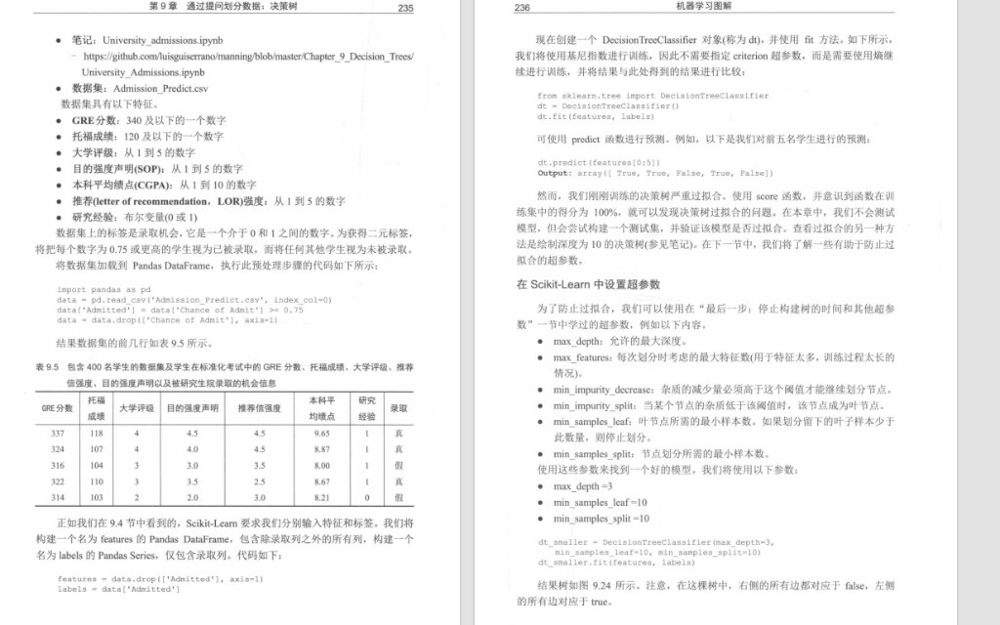
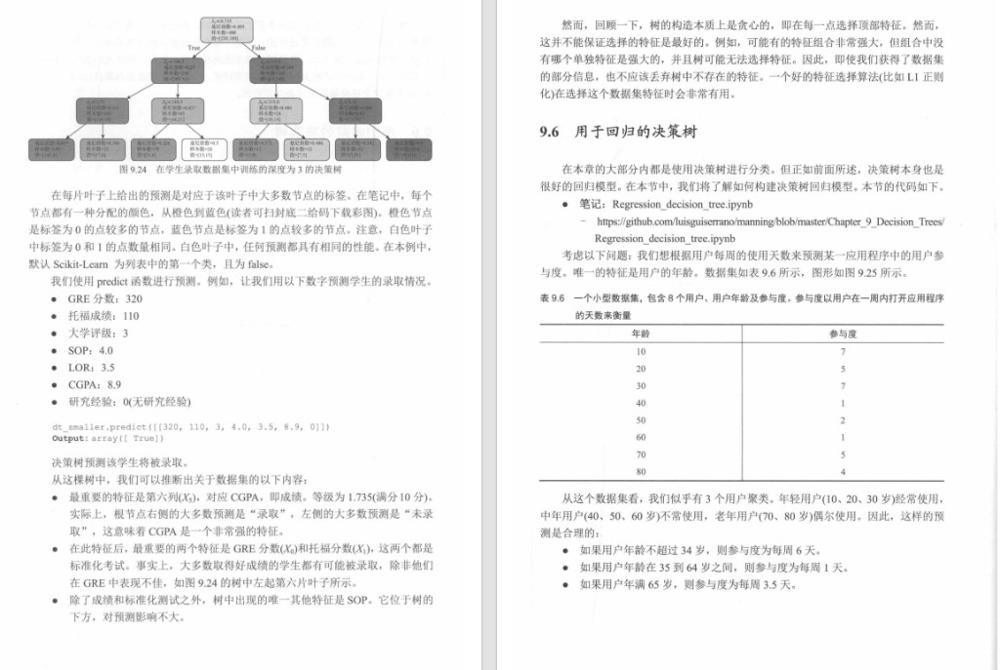
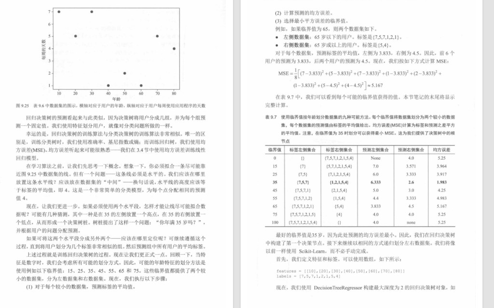
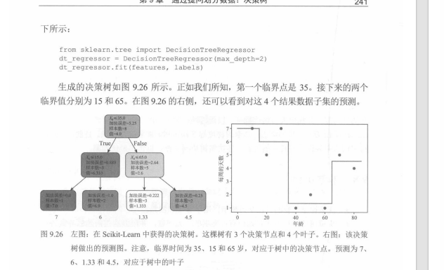

# 04. 决策树 9.5 招生案例与 9.6 回归树

本节对应教材第 9 章 **9.5 实际应用：使用 Scikit-Learn 构建招生模型** 与 **9.6 回归决策树**：在真实表格数据上走通「读入 → 特征与标签 → 训练 → 过拟合与正则化 → 预测」，再转到**连续标签**下的 **MSE** 与 **`DecisionTreeRegressor`**。可与 `03.决策树进阶：非二元特征、连续特征与边界.md` 中的玩具数据对照。

---

## 一、9.5 实际应用：研究生录取预测

### 1. 任务与数据

教材用 **Kaggle** 上的研究生录取相关数据（具体链接见原书附录 C），文件名常见为 **`Admission_Predict.csv`**。目标是根据申请人背景预测**是否录取**（二分类）。

**特征（示例列名以英文为准）**

| 含义 | 说明 |
|------|------|
| GRE Score | 满分 340 |
| TOEFL Score | 满分 120 |
| University Rating | 1～5 |
| SOP | Statement of Purpose，1～5 |
| LOR | 推荐信强度，1～5 |
| CGPA | 本科成绩，约 1～10 |
| Research | 是否有研究经历，`0` / `1` |

**标签构造**：原表有连续列 **`Chance of Admit`**（录取概率 0～1）。教材将其转为**布尔标签**：

- `Chance of Admit >= 0.75` → **`Admitted = True`**
- 否则 → **`False`**

然后**删除**原始概率列，只保留二分类标签。


### 2. 读入与预处理（代码骨架）

```python
import pandas as pd

data = pd.read_csv("Admission_Predict.csv", index_col=0)
data["Admitted"] = data["Chance of Admit"] >= 0.75
data = data.drop(["Chance of Admit"], axis=1)

features = data.drop(["Admitted"], axis=1)
labels = data["Admitted"]
```

**表 9.5** 展示处理后的前几行：数值特征 + 最后一列「是否录取」。



### 3. 训练、过拟合与超参数

```python
from sklearn.tree import DecisionTreeClassifier

dt = DecisionTreeClassifier()
dt.fit(features, labels)
```

在**训练集**上直接算准确率，容易接近 **100%**——典型 **过拟合**（树把噪声也记住）。教材因此介绍通过**超参数**限制树的生长，例如：

- `max_depth`：树的最大深度  
- `max_features`：每次分裂最多考虑的特征数  
- `min_impurity_decrease`：分裂所需的最小不纯度下降（新版本常用；旧名 `min_impurity_split` 已弃用）  
- `min_samples_leaf`：叶子最少样本数  
- `min_samples_split`：内部节点再分裂所需的最少样本数  

**带约束的模型示例**：

```python
dt_smaller = DecisionTreeClassifier(
    max_depth=3,
    min_samples_leaf=10,
    min_samples_split=10,
)
dt_smaller.fit(features, labels)
```

可视化时（如 `plot_tree`），教材约定：**左分支**常表示条件为 **True**，**右分支**为 **False**（以你使用的 sklearn 版本与绘图选项为准）。

### 4. 图 9.24：深度 3、以基尼为不纯度的树

下图对应 **`dt_smaller`** 一类设置：根节点多在 **`X[6]`（CGPA）** 上分裂（如 `<= 8.735`），说明在示例中 **GPA 是最强信号**；其次常见 **`X[0]`（GRE）**、**`X[1]`（TOEFL）**；**SOP（`X[3]`）** 等出现位置更靠下，影响相对次要。



### 5. 单条样本预测示例

教材给出一名学生的特征（GRE 320、TOEFL 110、院校评级 3、SOP 4.0、LOR 3.5、**CGPA 8.9**、无研究 0），用**与训练时相同的列顺序**组成一行向量：

```python
dt_smaller.predict([[320, 110, 3, 4.0, 3.5, 8.9, 0]])
# 示例输出：array([ True])   # 预测为录取
```

实际项目中应先 `train_test_split` 或交叉验证，再报告测试集表现；教材此处重在演示 **API 用法**。

---

## 二、9.6 回归决策树：用 MSE 切分、叶子上取平均

### 1. 与分类树的区别

- **分类树**：叶子上多为**多数类**；分裂准则常用**基尼**或**熵**。  
- **回归树**：标签为**实数**；分裂时常最小化**均方误差 MSE**（或相关准则）；叶子上预测值为该叶内样本标签的**平均值**。

教材用 **表 9.6** 的极简数据：仅用**年龄**预测**每周使用 App 的天数**（Engagement）。

| 年龄 | 每周天数 |
|------|----------|
| 10 | 7 |
| 20 | 5 |
| 30 | 7 |
| 40 | 1 |
| 50 | 2 |
| 60 | 1 |
| 70 | 5 |
| 80 | 4 |

按年龄粗分三组时，教材给出各组**平均** engagement 的直觉（例如年轻组约 **6** 天、中年组约 **1** 天、老年组约 **3.5** 天），用来说明「一组给一个常数预测」的思想。

**贪心提醒**：树在每一步只选**当前最优**分裂，未必全局最优；若特征单独看都不强但组合很强，可能需要其他特征选择或模型。

### 2. 图 9.25、表 9.7：阈值搜索与 MSE

- 若全数据只用**一条水平线**（一个常数预测），最优常数可取全体标签的**平均**（本例为 **4**）。  
- 若按年龄**分裂**成两段，每段用各自**均值**预测，可减小总体 MSE。

教材对阈值 **65** 给出演算示例：左段年龄 `< 65` 标签 `{7,5,7,1,2,1}`，均值约 **`3.833`**；右段 `≥ 65` 为 `{5,4}`，均值 **`4.5`**；代入平方误差可得到该阈值下的 MSE（书中算得约 **`5.167`**，以原书为准）。

**表 9.7** 枚举多个候选临界值；其中 **临界值 35** 对应**最小 MSE**，约为 **`1.983`**，作为第一次划分的优选。



### 3. 图 9.26：`DecisionTreeRegressor` 与阶梯预测

```python
from sklearn.tree import DecisionTreeRegressor

features = [[10], [20], [30], [40], [50], [60], [70], [80]]
labels = [7, 5, 7, 1, 2, 1, 5, 4]

dt_regressor = DecisionTreeRegressor(max_depth=2)
dt_regressor.fit(features, labels)
```

教材中 **`max_depth=2`** 得到深度 2 的树：**第一次**分裂约在年龄 **`35`**，其下再在 **`15`**、**`65`** 等处细分；四个叶子上的 **`value`** 分别为约 **`7.0`、`6.0`、`1.333`、`4.5`**，与右图**分段水平**的预测曲线一致（阶梯函数）。



---

## 三、最佳实践（接教材）

- **划分训练 / 测试**或做**交叉验证**，勿仅用训练集准确率判断「好坏」。  
- **过拟合**时优先调 `max_depth`、`min_samples_leaf`，而不是一味加深树。  
- **回归**任务用 `DecisionTreeRegressor`；评价用 MSE、MAE 等，而不是分类准确率。  
- **特征列顺序**与 `predict([[...]])` 中元素顺序必须一致。

---

## 四、极简总结

- **9.5**：CSV → 构造二分类标签 → `DecisionTreeClassifier` → 小深度 + 叶/分裂样本下限缓解过拟合 → `predict`。  
- **9.6**：连续标签 → 以 **MSE** 思想分裂 → 叶上取**均值** → `DecisionTreeRegressor` → 预测曲线为**分段常数**。

---

## 五、教材配套 Notebook（原书 GitHub，文件名供检索）

- `University_admissions.ipynb`（招生分类）  
- `Regression_decision_tree.ipynb`（年龄–活跃度回归）  

英文原书仓库示例：  
https://github.com/luisguiserrano/manning/tree/master/Chapter_9_Decision_Trees
