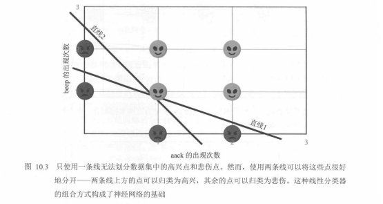
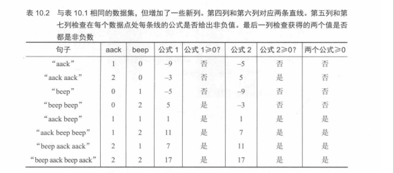
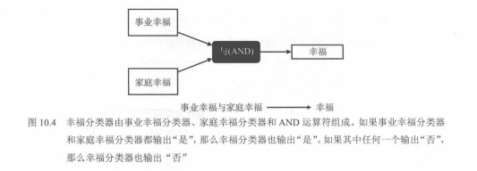
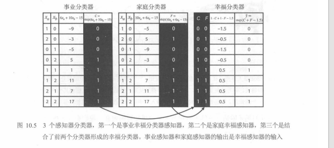
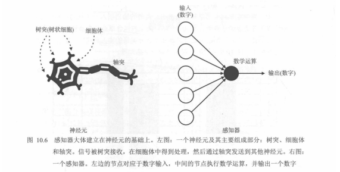
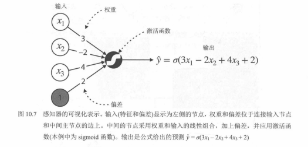
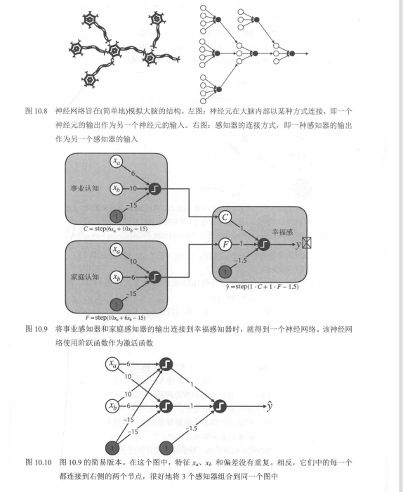

# 02. 神经网络入门：从简单感知机到复杂分类边界

本篇顺着教材叙事：**数据动机 → 两条直线 / AND 逻辑 → 感知机公式与画图法 → 小网络 → 激活与对比 → 一般 MLP → 逐层边界**。  
下列 **图 10.2～图 10.15** 与 **表 10.2** 均已配截图（路径在 `images/`）。

---

## 一、图 10.2：线性不可分——为什么需要更强模型

用外星人语句里 `aack`、`beep` 的出现次数作特征，判断**高兴**还是**悲伤**。常常是「两词都出现才高兴」，数据呈**中间一团、周围一圈**的结构，**一条直线**切不开。

**对应图示：图 10.2**

---

## 二、图 10.3：一条线不行，两条线可以

同一数据集上，**单条直线**无法分开高兴点与悲伤点；但用**两条相交的直线**划分半平面，使「同时落在两条线指定一侧」的区域包住高兴点，即可分开。这就是「多个线性分类器组合」的直观起点。

**对应图示：图 10.3**

---

## 三、表 10.2、图 10.4、图 10.5：两条公式 + AND 逻辑

**表 10.2** 在表 10.1 基础上增加两列线性得分（**公式 1、公式 2**），并检查是否 `≥ 0`，最后一列等价于两个条件**同时成立**（逻辑 **AND**）。它把「几何上的两条线」和「表格里的逐句判定」对齐。

**对应图示：表 10.2**

**图 10.4** 用流程说明：**事业幸福分类器**与**家庭幸福分类器**的输出进入 **AND**，得到**幸福**——与表中「两个公式都非负」同一思想。

**对应图示：图 10.4**

**图 10.5** 把故事换成「事业 / 家庭 / 幸福」三个感知机，并给出 8 个样本上的**逐步数值表**：前两个感知机输出 `C`、`F`，再送入第三个（偏置 `-1.5`），实现 **AND**（两路都为 1 时输出才为 1）。

**对应图示：图 10.5**

---

## 四、图 10.6、图 10.7：生物神经元 ↔ 感知机；加权求和 + 激活

**图 10.6** 对照：树突接收信号、胞体整合、轴突输出 ↔ 左侧多个数值输入、中间运算、右侧一个输出。

**对应图示：图 10.6**

**图 10.7** 给出标准画法：特征 `x1,x2,x3` 与偏置 `1`，边上标**权重**与**偏差**，中间经**激活函数**（例中为 sigmoid），输出 `y_hat = σ(3x1 - 2x2 + 4x3 + 2)`。

**对应图示：图 10.7**

---

## 五、图 10.8～图 10.10：从「脑内连接」到「网络示意图」

教材一页内常含三张小图：

- **图 10.8**：生物神经元互联 ↔ 感知机之间前后相接。  
- **图 10.9**：「事业认知」「家庭认知」两个感知机接到「幸福感」输出（阶跃激活）。  
- **图 10.10**：**简化图**——`xa,xb` 与偏置不重复画，一次画清三层连接。

**对应图示：图 10.8、图 10.9、图 10.10（同页）**

---

## 六、图 10.11：单感知机边界仍是直线

在 `(xa, xb)` 平面上，一个感知机对应**一条直线**；阶跃函数给出硬 0/1 分区，sigmoid 给出 `(0,1)` 上的软输出。

**对应图示：图 10.11**

---

## 七、图 10.12：两个隐单元 + 输出；阶跃 vs sigmoid 边界

两个线性分类器 `C、F` 与偏置输入第三个感知机：**阶跃**得到分段折线式区域；**sigmoid** 得到更光滑的边界。

**对应图示：图 10.12**

---

## 八、图 10.13：线性子分类器 vs 网络整体边界

四宫格对比：单独 `C`、单独 `F` 都会错分；用网络组合（阶跃或 sigmoid）后得到可分区域的边界。

**对应图示：图 10.13**

---

## 九、图 10.14：一般全连接 MLP（含偏置节点）

输入层（特征 + 偏置）→ 多个隐藏层 → 输出层；层间**全连接**到下一层所有**非偏置**节点。

**对应图示：图 10.14**

---

## 十、图 10.15：逐层组合——边界越来越复杂

每个隐藏节点可对应一块可解释的边界；层数增加时，边界由直线片段组合成越来越复杂的形状（图中常省略偏置节点的重复绘制）。

**对应图示：图 10.15**

---

## 简短总结

| 内容 | 图 / 表 |
|------|---------|
| 数据动机、线性不可分 | 图 10.2 |
| 两条直线可分 | 图 10.3 |
| 公式表 + AND | 表 10.2 |
| 流程与门 | 图 10.4 |
| 三感知机数值表 | 图 10.5 |
| 生物类比 | 图 10.6 |
| 感知机画图与 sigmoid 例 | 图 10.7 |
| 小网络逐步画 | 图 10.8～10.10 |
| 单线边界 | 图 10.11 |
| 组合 + 激活对比 | 图 10.12 |
| 多图对比 | 图 10.13 |
| 一般 MLP | 图 10.14 |
| 逐层复杂边界 | 图 10.15 |
