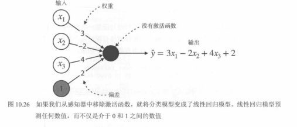

# 05. 神经网络 10.4 节：回归任务（配图版）

本节对应《机器学习图解》**第 10.4 节：用于回归的神经网络**，按「原理 → 改造 → 实战代码」组织。**图 10.26** 已在仓库；教材中**架构说明 + Keras 代码 + 训练结果**的整页截图请保存为 `images/fig10.4-regression-hyderabad-keras-and-results.png` 后，在第二节「配图」处自行插入一行 `` 即可。

图 10.26 亦见：`01.神经网络简介.md`（「图 10.26」小节）。

---

## 一、核心原理：从分类网络到回归的两处改动

神经网络既能分类也能回归，常见只需**两点调整**，其余训练流程（初始化、前向、反向、迭代）思路一致：

1. **去掉输出端的 sigmoid（或等价地把输出层做成「无激活」）**  
   - Sigmoid 把标量压到 `(0, 1)`，适合二分类概率。  
   - 回归要预测**任意实数**（如房价），输出层通常**不再接 sigmoid**，而是线性输出。  

2. **把损失从分类损失换成回归损失**  
   - 分类常用对数损失 / 交叉熵。  
   - 回归常用 **均方误差（MSE）** 或 **平均绝对误差（MAE）** 等。

**图 10.26** 说明：单层「感知机」若**没有激活函数**，输出就是特征的线性组合，即与**线性回归**同型；多层时隐藏层仍可用 ReLU 等引入非线性，**最后一层**常保持线性输出。

**对应图示：图 10.26**



---

## 二、实战案例：海得拉巴房价（Hyderabad.csv）

### 1. 数据与任务

- **数据**：教材示例为 **Hyderabad.csv**（海得拉巴房价）。  
- **输入**：约 **38** 维特征 → 输入张量最后一维为 38。  
- **输出**：房价（**一个**连续值）→ 输出层 **1** 个神经元。

### 2. 网络结构（与教材一致）

| 层 | 配置 | 作用 |
|----|------|------|
| 全连接 | 38 单元，ReLU | 教材示例中第一层与特征维一致，接 ReLU |
| Dropout | `p = 0.2` | 减轻过拟合 |
| 全连接 | 128 单元，ReLU | 隐藏层非线性组合 |
| Dropout | `0.2` | |
| 全连接 | 64 单元，ReLU | 继续抽象特征 |
| Dropout | `0.2` | |
| 全连接 | **1** 单元，**默认无激活（线性）** | 连续房价预测 |

**配图**：将教材「架构示意 + 代码 + 训练曲线/指标」页截为一张图，保存为：

`images/fig10.4-regression-hyderabad-keras-and-results.png`

保存后可在本段下方插入：

``

### 3. Keras 示例代码

```python
from keras.models import Sequential
from keras.layers import Dense, Dropout

model = Sequential()
model.add(Dense(38, activation="relu", input_shape=(38,)))
model.add(Dropout(0.2))
model.add(Dense(128, activation="relu"))
model.add(Dropout(0.2))
model.add(Dense(64, activation="relu"))
model.add(Dropout(0.2))
model.add(Dense(1))

model.compile(loss="mean_squared_error", optimizer="adam")
model.fit(features, labels, epochs=10, batch_size=10)
```

- **损失**：`mean_squared_error`（MSE），回归常用。  
- **优化器**：`adam`（教材示例）。  
- **训练**：`epochs=10`，`batch_size=10`；实际项目需配合验证集、早停、调参等。

教材中若报告 **RMSE** 等数值，可能随数据预处理、随机种子而变化；以原书为准。

---

## 三、要点小结

1. **分类 → 回归**：输出层线性化（不用 sigmoid 压 0～1）+ 回归损失（如 MSE）。  
2. **图 10.26**：无激活的单层即线性回归；深层回归仍依赖隐藏层非线性。  
3. **实践**：隐藏层 ReLU + Dropout 较常见；**最后一层 `Dense(1)` 不加激活** 即连续输出。  
4. **工程**：`Sequential` 堆层 → `compile` → `fit` 即可完成基线实验。

---

## 配图清单

| 顺序 | 内容 | 仓库文件 |
|------|------|----------|
| 1 | 图 10.26（原理） | `images/fig10.26-linear-regression-no-activation.png` |
| 2 | 10.4 实战页（架构 + 代码 + 结果） | `images/fig10.4-regression-hyderabad-keras-and-results.png`（待你补图） |
