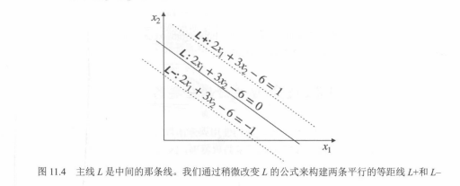

# 02. SVM：间隔、误差度量与软间隔（图 11.4～11.9）

在 `01.支持向量机简介：最大间隔直觉.md` 中，我们已经从几何上理解「要选间隔大的直线」。本节用教材图 **11.4～11.9** 把**决策线、两条边界线、间隔宽度、误差的度量**，以及**软间隔（容忍训练误差）**串成一条线。公式一律用反引号书写，便于直接放进 Markdown。

---

## 图 11.4：决策线 L 与两条平行边界线 L+、L−

中间**实线**为决策边界，可写成 `2*x1 + 3*x2 - 6 = 0`（记为 **L**）。在其两侧各画一条**平行且等距**的线，把常数项改为 `+1` 与 `−1`，得到 **L+** 与 **L−**，用来框出「间隔带」。

---

## 图 11.5：用两条边界衡量「误差」（与垂直距离相关但非同一回事）

当分类器由**两条**平行边界定义时，对某个分错的点，可分别度量它相对两条线的「误差 1」「误差 2」，再**相加**得到与该点相关的总误差。教材特别说明：图中的误差线段**不一定**是点到直线的垂直距离，但与距离**成比例**，足以用于构造可优化的损失。

---

## 图 11.6：两条平行线之间的间隔宽度

若两条平行线写成 `w1*x1 + w2*x2 + b = 1` 与 `w1*x1 + w2*x2 + b = -1`，则它们之间的**垂直距离**（间隔宽度）为：

`距离 = 2 / sqrt(w1^2 + w2^2)`

分母是权重向量 `(w1, w2)` 的长度。因此**间隔要大** ⇔ **`sqrt(w1^2 + w2^2)` 要小** ⇔ 与最小化权重的平方和同一方向（高维推广为最小化 `||w||`）。

---

## 图 11.7：好分类器 vs 坏分类器（间隔大 ↔ 权重范数小）

左图 **SVM 1**：`3*x1 + 4*x2 - 5 = ±1` 两条边界，间隔标注约 **0.4**，误差项示例为 `3^2 + 4^2 = 25`。  
右图 **SVM 2**：同一方向但系数放大 10 倍（`30*x1 + 40*x2 - 50 = ±1`），间隔缩为约 **0.04**，误差项 `30^2 + 40^2 = 2500` 更大。

直觉：**在能分开数据的前提下**，希望间隔大（权重不要无谓放大）。这与最小化 `1/2 * ||w||^2`、从而最大化间隔的经典 SVM 目标一致。

---

## 图 11.8：三种情况——又好又分对、分错、分对但间隔太窄

- **左**：间隔适中且**全部分对**——理想。  
- **中**：边界角度不当，出现**误分类**——差。  
- **右**：全部分对，但两条线**贴得太近**——训练上「全对」，但**间隔过小**，泛化往往不如左图。

---

## 图 11.9：软间隔——大间隔可能伴随训练误差，窄间隔可能零训练误差

- **左**：两条线**相距较远**（间隔大），但个别点落在「不该在的一侧」——**有训练误差**，有时却更**稳健**。  
- **右**：两条线**很近**，训练集上**零误差**，但易**过拟合**噪声。

实际中通过**软间隔**与参数（如惩罚系数 **C**）在「间隔宽度」与「训练误差」之间折中：C 小则更像左图倾向；C 大则更像右图倾向（以教材与实现为准）。

---

## 配图清单

| 图号 | 文件 |
|------|------|
| 11.4 | `images/fig11.4-margin-lines-L-Lplus-Lminus.png` |
| 11.5 | `images/fig11.5-two-boundaries-error-sum.png` |
| 11.6 | `images/fig11.6-distance-between-parallel-lines.png` |
| 11.7 | `images/fig11.7-margin-vs-weight-norm-svm1-svm2.png` |
| 11.8 | `images/fig11.8-good-and-bad-classifiers.png` |
| 11.9 | `images/fig11.9-soft-margin-tradeoff.png` |

下一节（近线性可分数据、线性 SVM 与准确率，**图 11.11～11.12**）：`03.近线性可分与线性SVM：图11.11至11.12.md`
