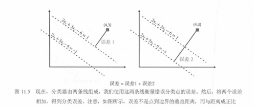
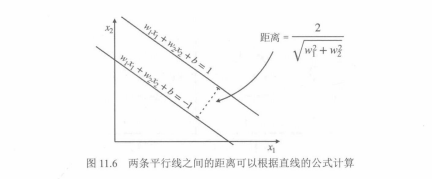
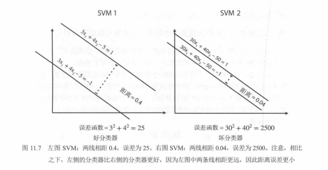
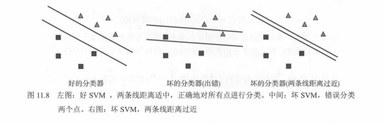
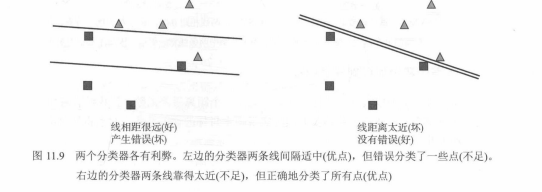

# SVM 核心直觉与 C 参数：间隔、错分与调参

本节用《机器学习图解》第 11 章中的图示，把 SVM 的核心思想概括成一个直观版本：**既要尽量分对样本，又要尽量保持较大的分类间隔**。这里的公式与“分类误差 + 距离误差”写法主要服务于教材中的几何直觉，便于理解 `C` 参数如何在“分对”与“间隔”之间做权衡。

---

## 一、SVM 的双目标：分对样本 + 保持大间隔

SVM 不只是寻找一条能把两类样本分开的直线，还希望这条直线离两类最近的样本都**尽量远**。  
因此，可以把它理解为同时追求两个目标：

1. **分类正确**：尽量少错分样本。  
2. **间隔最大化**：让边界两侧的支持向量尽量远离分界面。  

教材直觉上可把总目标理解为：

`总目标 = 分类误差 + 距离误差`

这不是 Scikit-Learn 文档里最标准的 SVM 写法，但很适合作为“为什么 SVM 不只看分类是否正确”的入门直觉。

---

## 二、分类误差：样本分错时要付出代价

教材把 SVM 的两条平行边界线当作两个“独立的感知器”来理解：  

- `L+ : w1*x1 + w2*x2 + b = 1`
- `L- : w1*x1 + w2*x2 + b = -1`

对于某个样本点：

- 若样本落在正确的一侧，则误差记为 `0`
- 若样本被分错，则误差与 `|w1*x1 + w2*x2 + b|` 成比例

图 11.5 展示了教材对“误差”的几何解释：不是严格的欧氏距离，但与距离成比例，足够作为直观损失来理解。

---

## 三、距离误差：为什么 `w1^2 + w2^2` 越大越不好

对两条平行线：

- `w1*x1 + w2*x2 + b = 1`
- `w1*x1 + w2*x2 + b = -1`

它们的垂直距离是：

`距离 = 2 / sqrt(w1^2 + w2^2)`

这意味着：

- `w1^2 + w2^2` 越大，间隔越小  
- `w1^2 + w2^2` 越小，间隔越大  

所以教材用 `w1^2 + w2^2` 作为“距离误差”的直觉代表：它越大，说明分类器把边界挤得越近，泛化通常越差。

图 11.6 给出了这个关系，图 11.7 则把“好分类器 vs 坏分类器”的差异画得更直观。

---

## 四、SVM 分类器的好坏标准

图 11.8 很适合总结“什么样的分类器才算好”：

- **好的分类器**：全部分对，而且两条边界线间隔较大  
- **坏的分类器（分错）**：存在明显误分类  
- **坏的分类器（间隔过近）**：虽然分对了，但边界贴着样本，鲁棒性差  

从这里就能看出：**SVM 的优势不是只追求训练集全对，而是追求“分对且留有余量”**。

---

## 五、`C` 参数：平衡错分代价与间隔大小

为了在“尽量分对”与“尽量大间隔”之间做平衡，教材引入参数 `C`。  
直觉上可以写成：

`总目标 = C * 分类误差 + 距离误差`

其中：

- **`C` 大**：更不愿意容忍错分，模型会更努力贴近训练集  
- **`C` 小**：更强调大间隔，允许少量样本分错或落在间隔内  

这意味着：

- `C ↑`：分类更“严格”，间隔容易变小，过拟合风险上升  
- `C ↓`：分类更“宽松”，间隔更大，泛化通常更稳  

图 11.9 用“训练误差 vs 间隔”的方式给出软间隔直觉，而图 11.13 则是 `C` 参数改变后的实际边界效果。

---

## 六、`C` 参数的直观结论

| `C` 值 | 模型倾向 | 典型效果 | 适用场景 |
|------|------|------|------|
| 小（如 `0.01`） | 更看重大间隔 | 允许少量错分，边界更平缓，鲁棒性更强 | 数据噪声较多 |
| 中（如 `1`） | 在两者间平衡 | 边界适中，通常可作 baseline | 通用场景 |
| 大（如 `100`） | 更看重训练集分对 | 边界更贴样本，间隔缩小，过拟合风险更高 | 数据较干净、错分代价高 |

要注意：**`C` 越大并不等于效果越好**。  
它只表示模型更努力去减少训练集上的错误，但测试集表现仍要靠验证集或交叉验证来判断。

---

## 七、最佳实践与常见误区

### 最佳实践

1. 先用默认 `C=1.0` 作为 baseline。  
2. 在对数尺度上搜索 `C`，如 `[1e-3, 1e-2, ..., 1e3]`。  
3. 若使用非线性核（如 RBF），要和 `gamma` 一起调参。  

### 常见误区

1. **盲目追求训练集全对**：容易把 `C` 调太大，导致过拟合。  
2. **把教材直觉公式当成唯一标准公式**：实际实现常写作“正则项 + `C × 损失项`”。  
3. **忽略数据分布差异**：不同数据集的最优 `C` 往往完全不同。  

---

## 八、极简总结

SVM 的核心不是“只要分对就行”，而是：

- 尽量把样本分对  
- 同时让边界离样本尽量远  

`C` 的作用，就是调节这两者的权重：

- `C` 大：更关注分对，间隔变小，过拟合风险更高  
- `C` 小：更关注间隔，允许少量错误，模型更稳健  

真正使用时，应通过验证集或交叉验证来选择 `C`，而不是经验拍脑袋。

