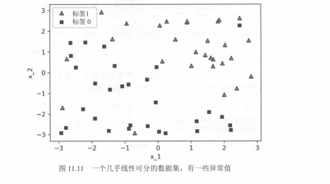
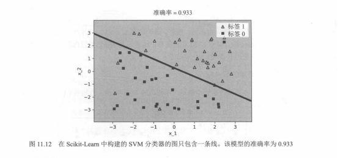

# Scikit-Learn 实现线性 SVM 与 C 参数调参

本节承接 `SVM核心直觉与C参数：间隔、错分与调参.md` 的几何直觉，把 SVM 直接落到 Scikit-Learn 代码上：用 `SVC(kernel='linear')` 训练线性分类器，再对比不同 `C` 值下的边界变化与训练集准确率。

这里要特别说明：文中的 `score(features, labels)` 是**训练集准确率**，主要用于配合教材图示理解 `C` 参数如何改变边界，**不能直接当作泛化性能结论**。

---

## 一、数据集与目标

教材使用的是一个**几乎线性可分**的二维二分类数据集，包含少量异常值/噪声点。  
图 11.11 展示了两类样本分布：

- 三角形：标签 1  
- 方块：标签 0  



---

## 二、最小可用代码：线性 SVM

```python
from sklearn.svm import SVC
import pandas as pd

# 假设数据已读为 features 和 labels
# data = pd.read_csv("linear.csv")
# features = data[["x_1", "x_2"]]
# labels = data["label"]

svm_linear = SVC(kernel="linear")
svm_linear.fit(features, labels)

accuracy = svm_linear.score(features, labels)
print(f"训练集准确率: {accuracy:.3f}")
```

在教材示例中，这个模型在当前数据上的准确率约为 **0.933**。  
默认 `C=1.0`，因此模型是在“尽量分对”和“保持适度间隔”之间做一个折中。

图 11.12 展示了这个默认线性 SVM 的边界效果。



---

## 三、`C=0.01` vs `C=100`

接下来只改一个参数：`C`。

```python
from sklearn.svm import SVC

# C 较小：更强调大间隔
svm_c_001 = SVC(kernel="linear", C=0.01)
svm_c_001.fit(features, labels)
acc_001 = svm_c_001.score(features, labels)
print(f"C=0.01 训练集准确率: {acc_001:.3f}")

# C 较大：更强调分对训练样本
svm_c_100 = SVC(kernel="linear", C=100)
svm_c_100.fit(features, labels)
acc_100 = svm_c_100.score(features, labels)
print(f"C=100 训练集准确率: {acc_100:.3f}")
```

教材图示中常见的结果大致为：

- `C = 0.01`：准确率约 `0.867`
- `C = 1.0`：准确率约 `0.933`
- `C = 100`：准确率约 `0.917`

图 11.13 把小 `C` 与大 `C` 的边界差异画得很直观。


---

## 四、结果怎么理解

| 参数 | 训练集准确率 | 边界特点 | 模型倾向 |
|------|--------------|----------|----------|
| `C=0.01` | 约 `0.867` | 间隔更大，边界更平缓 | 更强调鲁棒性与大间隔 |
| `C=1.0` | 约 `0.933` | 间隔适中 | 平衡分类与泛化 |
| `C=100` | 约 `0.917` | 间隔更小，更贴近样本 | 更努力拟合训练集 |

从这个结果里可以看到一个非常重要的事实：

> **`C` 越大，不一定训练效果就越好，更不一定泛化能力就越强。**

在教材示例里，`C=100` 的训练集准确率甚至还低于默认 `C=1.0`，说明过大的 `C` 并不会自动带来更优结果。

---

## 五、从教材直觉到现代写法

教材常把 `C` 理解成“分类误差”的权重系数，这样便于记忆：

`总目标 ≈ C * 分类误差 + 距离误差`

在现代机器学习框架里，更常见的理解是：

- 正则项：控制间隔大小  
- 损失项：衡量错分或间隔违反  
- `C`：平衡两者  

所以，无论哪种写法，核心结论都一样：

- `C` 大：更不愿意容忍错分或间隔违反  
- `C` 小：更愿意保留大间隔  

---

## 六、最佳实践

### 1. 先用默认值做 baseline

```python
SVC(kernel="linear", C=1.0)
```

默认值通常是个不错的起点。

### 2. 用交叉验证选 `C`

推荐在对数空间里搜索，例如：

`[1e-4, 1e-3, 1e-2, 1e-1, 1, 10, 100, 1000]`

### 3. 非线性核要与 `gamma` 一起调

如果换成 `kernel='rbf'`，仅调 `C` 往往不够，还要和 `gamma` 联合搜索。

---

## 七、常见误区

1. **把训练集准确率当最终结论**：应结合验证集或交叉验证。  
2. **认为 `C` 越大越好**：大 `C` 可能导致过拟合。  
3. **混淆线性与非线性 SVM**：`kernel='linear'` 更适合近线性可分的数据。  

---

## 八、一个可运行的演示示例

下面这段代码不一定复现教材里的准确率数值，但非常适合演示 `C` 如何影响线性 SVM 的边界：

```python
import numpy as np
import matplotlib.pyplot as plt
from sklearn.svm import SVC
from sklearn.datasets import make_blobs

X, y = make_blobs(
    n_samples=100,
    centers=2,
    random_state=42,
    cluster_std=1.2,
)

X[:, 0] = X[:, 0] * 0.8 + 0.5
X[:, 1] = X[:, 1] * 0.8 - 0.5

svm_default = SVC(kernel="linear", C=1.0).fit(X, y)
svm_c001 = SVC(kernel="linear", C=0.01).fit(X, y)
svm_c100 = SVC(kernel="linear", C=100).fit(X, y)

def plot_svm_boundary(model, X, y, title, ax):
    ax.scatter(X[y == 0, 0], X[y == 0, 1], c="black", marker="s", label="标签0")
    ax.scatter(X[y == 1, 0], X[y == 1, 1], c="black", marker="^", label="标签1")

    x_min, x_max = X[:, 0].min() - 1, X[:, 0].max() + 1
    y_min, y_max = X[:, 1].min() - 1, X[:, 1].max() + 1
    xx, yy = np.meshgrid(
        np.arange(x_min, x_max, 0.02),
        np.arange(y_min, y_max, 0.02),
    )

    Z = model.predict(np.c_[xx.ravel(), yy.ravel()])
    Z = Z.reshape(xx.shape)
    ax.contourf(xx, yy, Z, alpha=0.3, cmap=plt.cm.Paired)

    w = model.coef_[0]
    b = model.intercept_[0]
    x_plot = np.linspace(x_min, x_max, 100)
    y_plot = (-w[0] * x_plot - b) / w[1]
    ax.plot(x_plot, y_plot, "k-", linewidth=2)

    acc = model.score(X, y)
    ax.set_title(f"{title}\\n训练集准确率 = {acc:.3f}")
    ax.legend()
    ax.set_xlabel("x_1")
    ax.set_ylabel("x_2")

fig, axes = plt.subplots(1, 3, figsize=(18, 5))
plot_svm_boundary(svm_c001, X, y, "C = 0.01", axes[0])
plot_svm_boundary(svm_default, X, y, "C = 1.0", axes[1])
plot_svm_boundary(svm_c100, X, y, "C = 100", axes[2])
plt.tight_layout()
plt.show()
```

---

## 九、极简总结

- `SVC(kernel='linear')` 就能实现线性 SVM  
- `C` 控制“更看重分类正确”还是“更看重大间隔”  
- `C` 大不一定更好，最终应依靠交叉验证选择最优值  

