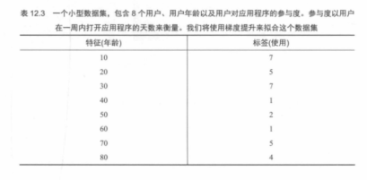
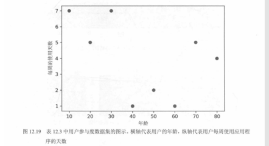

# 07. 用户数据示例：表 12.3 与图 12.19

本节用教材的一个小数据集说明“从表到图”的基本过程：先给出用户的年龄与某个行为标签（表 12.3），再把它画成散点图（图 12.19）。这类数据常用于回归或分类的入门示例：横轴为特征（年龄），纵轴为目标/标签或其计数形式（具体含义以教材描述为准）。

---

## 表 12.3：一个用户数据集（年龄与标签）

表中包含 8 个用户，每个用户有一个特征（年龄）与一个标签值（示例为某类应用使用天数/参与度等的离散数值）。

---

## 图 12.19：把表 12.3 画成散点图

散点图把“年龄—标签”关系直观呈现出来，便于观察趋势、离群点与是否适合用线性/非线性模型拟合。

---

## 配图清单

| 编号 | 文件 |
|------|------|
| 表 12.3 | `images/table12.3-user-dataset.png` |
| 12.19 | `images/fig12.19-user-data-scatter.png` |

下一节（梯度提升入门：弱学习器与残差，图 12.20～12.21、表 12.4）：`08.梯度提升入门：弱学习器与残差：图12.20至12.21与表12.4.md`

