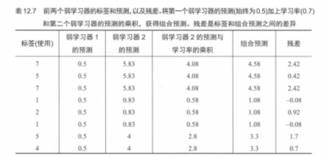

# 12. XGBoost 逐轮预测：组合预测与残差更新（表 12.7）

本节承接 `11.XGBoost第二棵树：拟合增量与更新预测：图12.25.md` 的“加一个修正项”直觉，用教材 **表 12.7** 把计算过程落到表格：第 1、2 个学习器各自给出预测；按学习率（或轮次权重）加权相加得到**组合预测**；再由真实标签与组合预测得到新的**残差**，为下一轮学习器提供学习目标。

---

## 表 12.7：两轮学习器的预测、组合预测与残差

表中常见列的含义（名称以教材为准）：

- **标签（`y`）**：真实值。  
- **学习器 1 的预测**：第 1 棵树/第 1 个弱学习器给出的预测。  
- **学习器 2 的预测**：第 2 个弱学习器拟合残差后给出的“修正项”预测。  
- **组合预测**：把前两轮按权重相加得到当前模型的输出（例如 \(F_2(x)=F_1(x)+\eta f_2(x)\)）。  
- **残差**：真实值减去组合预测（`y - 组合预测`），下一轮会尝试进一步拟合它。

---

## 配图清单

| 编号 | 文件 |
|------|------|
| 表 12.7 | `images/table12.7-two-learners-combined-preds.png` |

下一节（XGBoost：预测曲线与多轮叠加，图 12.26～12.27）：`13.XGBoost预测曲线与多轮叠加：图12.26至12.27.md`

