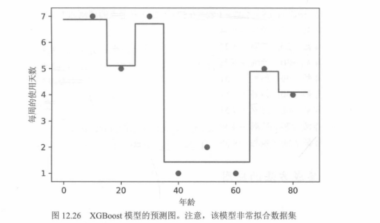
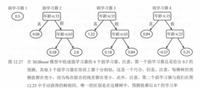

# 13. XGBoost：预测曲线与多轮叠加（图 12.26～12.27）

承接 `12.XGBoost逐轮预测：组合预测与残差更新：表12.7.md` 的“组合预测 + 残差更新”过程，本节用图 **12.26～12.27** 把结果画出来：随着弱学习器（浅树）一轮轮加入，模型在一维特征（年龄）上的预测曲线会逐步从粗糙走向贴合数据。

---

## 图 12.26：XGBoost 的预测曲线（一维上的分段常数函数）

当特征是一维（如 `Age`）且基学习器是浅树时，模型输出在数轴上表现为**台阶状曲线**：每个区间输出一个常数。多轮叠加后，台阶会越来越“合适”，从而更好地解释训练点的变化趋势。

---

## 图 12.27：4 个学习器的叠加（从初始常数到逐步修正）

图中展示了学习器 1～4 的结构与其在不同区间给出的修正值。直觉上：

- **学习器 1** 往往从一个简单的基线开始（例如常数预测）。  
- **学习器 2～4** 依次拟合前一轮的误差结构（残差/梯度方向），在需要的区间做“加一点/减一点”的修正。  
- 叠加后得到最终预测 \(F(x)=\sum_t \eta f_t(x)\)（记法依教材而定），对应图 12.26 的整体曲线。

---

## 配图清单

| 图号 | 文件 |
|------|------|
| 12.26 | `images/fig12.26-xgboost-prediction-curve.png` |
| 12.27 | `images/fig12.27-xgboost-4-learners.png` |

